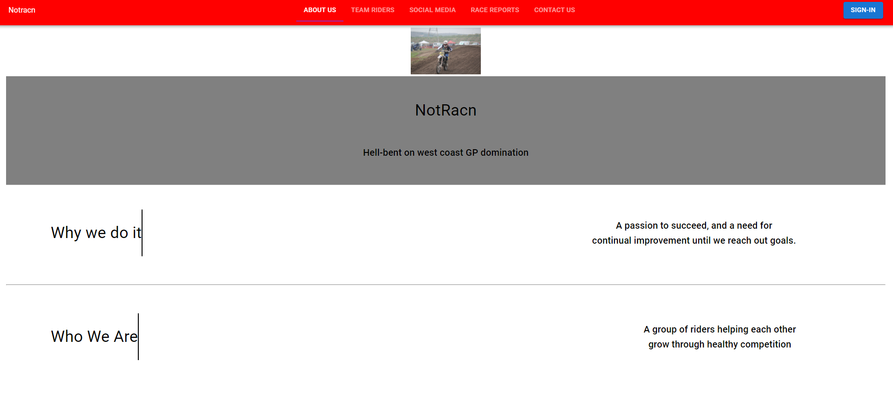
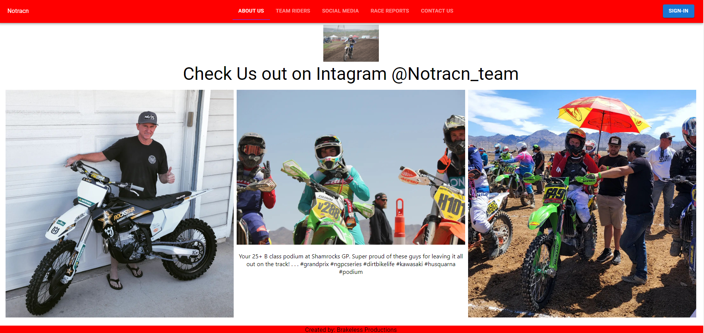
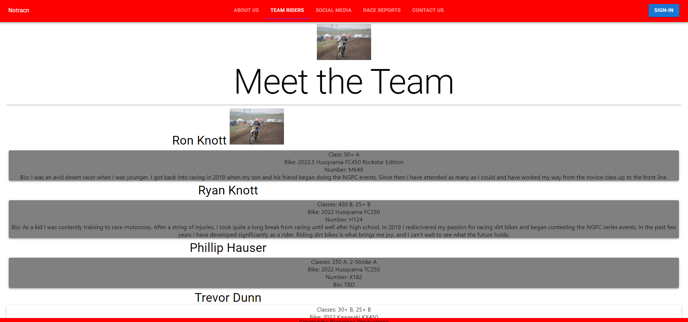

# NotRacn Team Page

## Description
This app was a mix of  a passion project and a final project at General Assembly. This team website has been one that I have wanted to build since I first started at GA. This is a full-stack MERN application. This is my first solo-project built in React. I had a great time learning to build a single-page application, and look forward to contuining to develop this skill by continuing work on this and other websites.

## Technologies Used
1. MongoDB
2. CSS
3. Javascript
4. React
5. Axios
6. Instagram Basic API
7. Heroku
8. GitHub

## Getting started
Use the following links to access my page  
https://notracn.herokuapp.com/ 

Use the following link to access my trello board  
https://trello.com/b/3rHa6ZxR/notracn-site

## Next steps
There are cerainly bugs that need addressing, but after those have been resolved the biggest improvements that I will add to this project will be visual/design enhancements. I feel like design is my weak point when it comes to building websites and plan to use this site to improve those skills

## Screenshots

